# ⚙️ SecureExpenseTracker Backend

<p align="center"><em>Spring Boot REST API backend for SecureExpenseTracker — with JWT Authentication and Role-based Access.</em></p>

---

## 🧠 Overview

The **SecureExpenseTracker Backend** is a secure and scalable RESTful API built using **Spring Boot**.
It handles all the backend logic for user authentication, registration, and expense management.
Each user’s data is protected through **JWT tokens**, and **role-based access control** ensures secure endpoint access.

---

## 🚀 Features

* 🔐 **JWT-based Authentication**
* 👤 **Role-based Authorization** (Admin/User)
* 💰 **Expense CRUD Operations**
* 🧾 **User-specific Expense Reports**
* 🛡️ **Secure REST API Design**
* 🌐 **CORS-enabled** for React frontend
* 🧪 **Unit Tests using JUnit & Mockito**

---

## 🛠️ Tech Stack

| Component      | Technology         |
| -------------- | ------------------ |
| **Framework**  | Spring Boot        |
| **ORM**        | JPA / Hibernate    |
| **Database**   | MySQL              |
| **Security**   | JWT Authentication |
| **Testing**    | JUnit, Mockito     |
| **Build Tool** | Maven              |

---

## 📂 Project Structure

```
SecureExpenseTracker/
│
├── backend/                # Spring Boot application
│   ├── src/main/java/...   # Controllers, Services, Repositories
│   ├── src/main/resources/ # Application properties
├── README.md               # Project Documentation
└── ...
```

---

## ⚙️ Setup & Installation

### 1 Configure Database

Open `src/main/resources/application.properties` and update:

```properties
spring.datasource.url=jdbc:mysql://localhost:3306/secure_expense_db
spring.datasource.username=root
spring.datasource.password=your_password
spring.jpa.hibernate.ddl-auto=update

# JWT Secret Key
jwt.secret=your_secret_key
```

---

### 2 Run the Backend Server

```bash
mvn spring-boot:run
```

Your backend will run on:
➡️ `http://localhost:8080`

---

## 🔗 API Endpoints

| Method   | Endpoint             | Description                      |
| -------- | -------------------- | -------------------------------- |
| `POST`   | `/api/auth/register` | Register a new user              |
| `POST`   | `/api/auth/login`    | Login user and get JWT token     |
| `GET`    | `/api/expenses`      | Get all expenses (User-specific) |
| `POST`   | `/api/expenses`      | Add a new expense                |
| `PUT`    | `/api/expenses/{id}` | Update an existing expense       |
| `DELETE` | `/api/expenses/{id}` | Delete an expense                |
| `GET`    | `/api/admin/users`   | (Admin) View all users           |

---

## 🧩 Application Run Screenshot

<p align="center">
  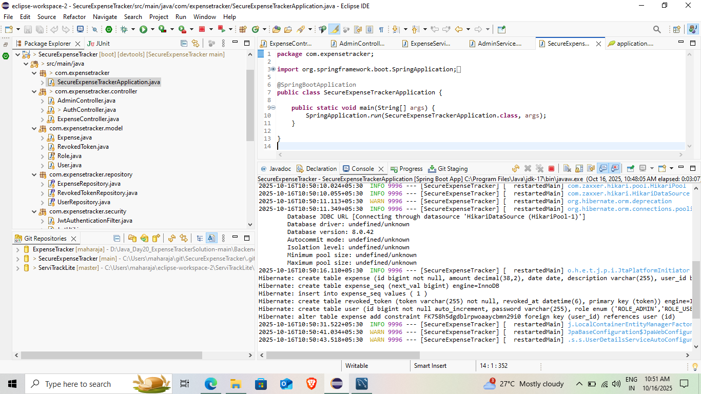
</p>

<p align="center"><em>Spring Boot backend started successfully on port 8080.</em></p>

---

## 🧪 Postman API Testing

### 🔐 Register API

<p align="center">
  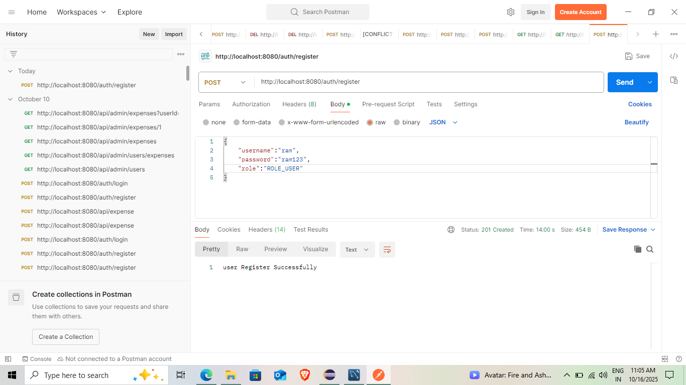
</p>

### 🔑 Login  API

<p align="center">
  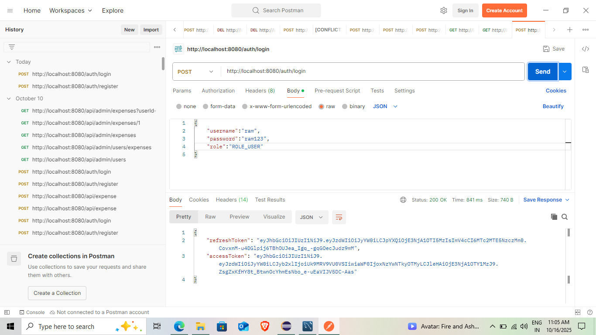
</p>


### 💰 Add & Get & Put & Delete Expense API

<p align="center">
  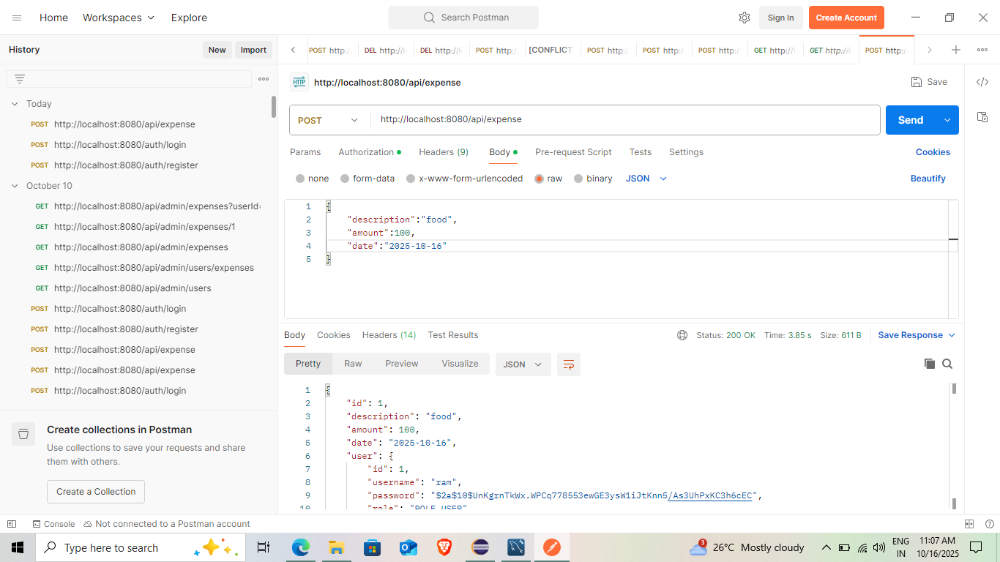
</p>

<p align="center">
  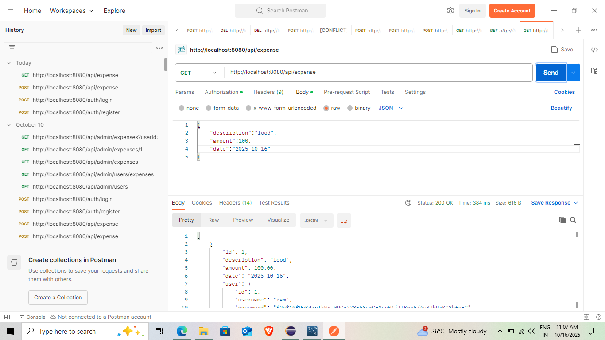
</p>

<p align="center">
  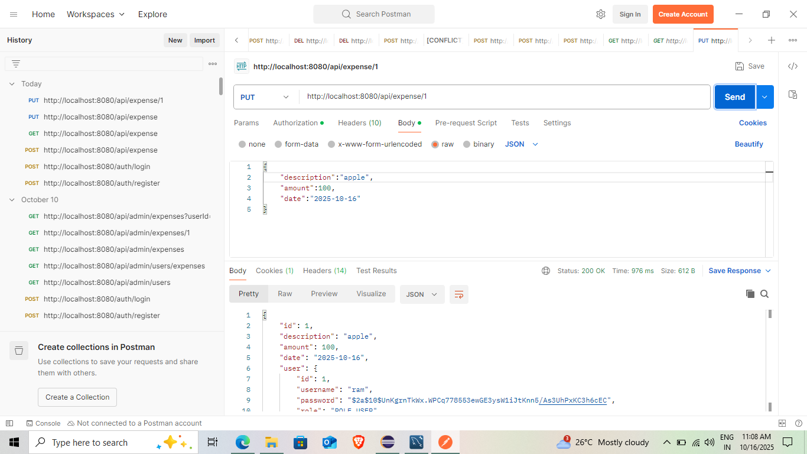
</p>

<p align="center">
  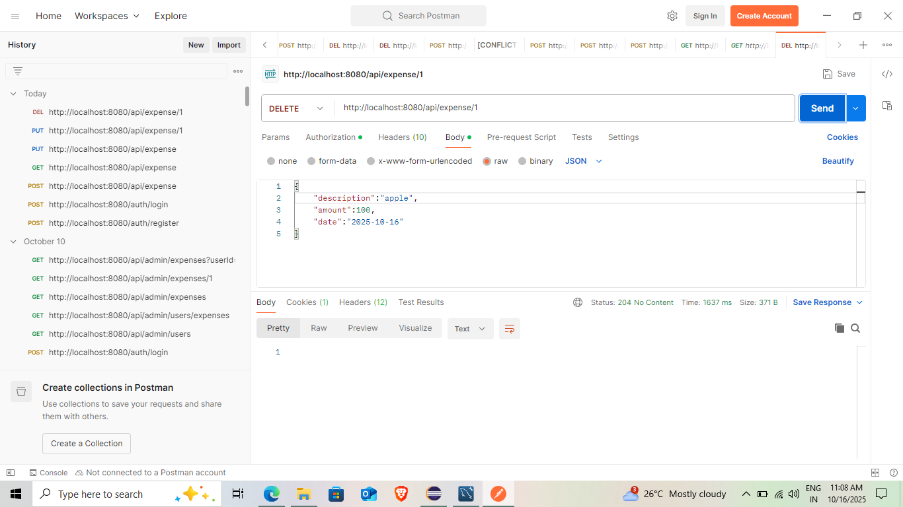
</p>

<p align="center"><em>Postman tests showing successful responses for authentication and expense APIs.</em></p>

---
### 🔑 Admin Login and Register and Working API
<p align="center">
  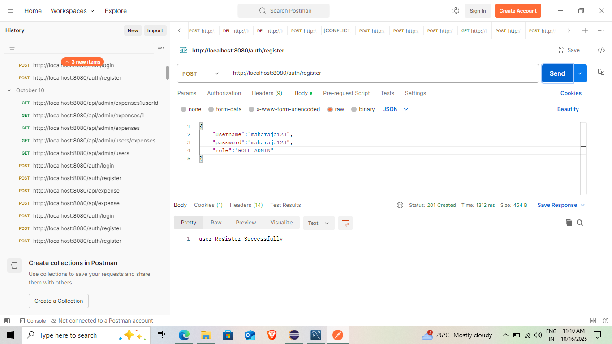
</p>

<p align="center">
  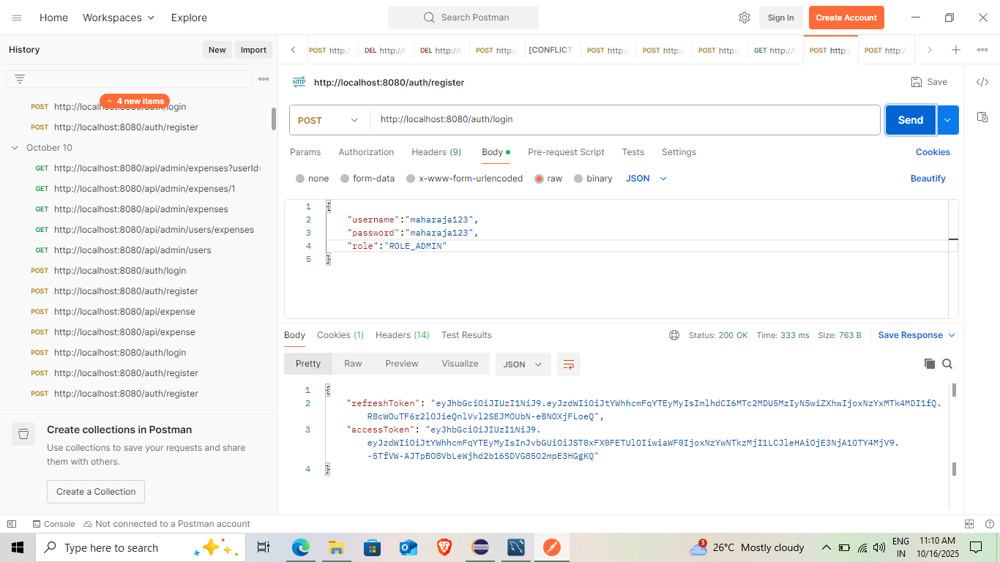
</p>

<p align="center">
  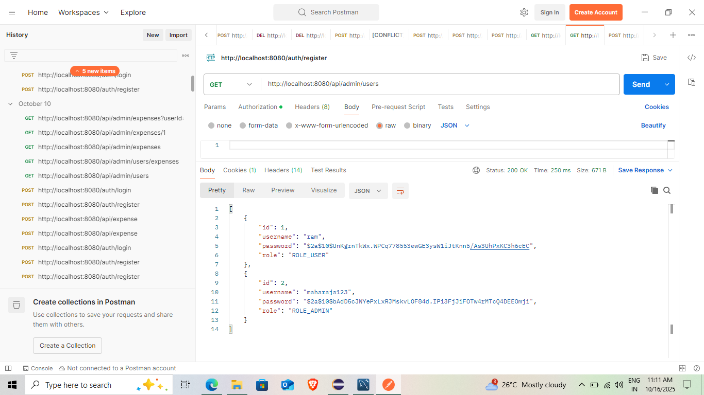
</p>

<p align="center">
  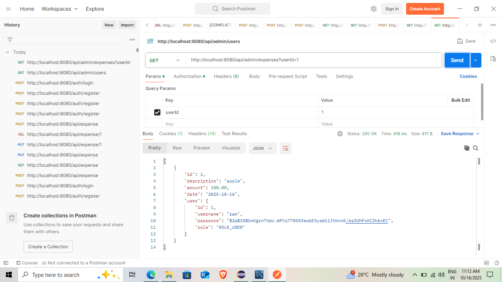
</p>

<p align="center"><em>Postman tests showing successful responses for Admin authentication and UserList APIs.</em></p>

---


## 🔒 Security Highlights

* Passwords encrypted using **BCrypt**
* **JWT Authentication** for secure API calls
* **Role-based Authorization** for Admin/User separation
* **CORS Configuration** for cross-origin access from React frontend

---
## 👨‍💻 Author

**MAHARAJA R**
📧 [mayamaharaja18@example.com](mailto:mayamaharaja18@example.com)
🌐 [Portfolio](https://maharaja77.github.io/maharaja/)
💼 [LinkedIn](https://www.linkedin.com/in/maharajaofficial)
🌐 [YouTube Channel](https://www.youtube.com/@tech_for_tech_world)

---
